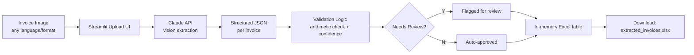
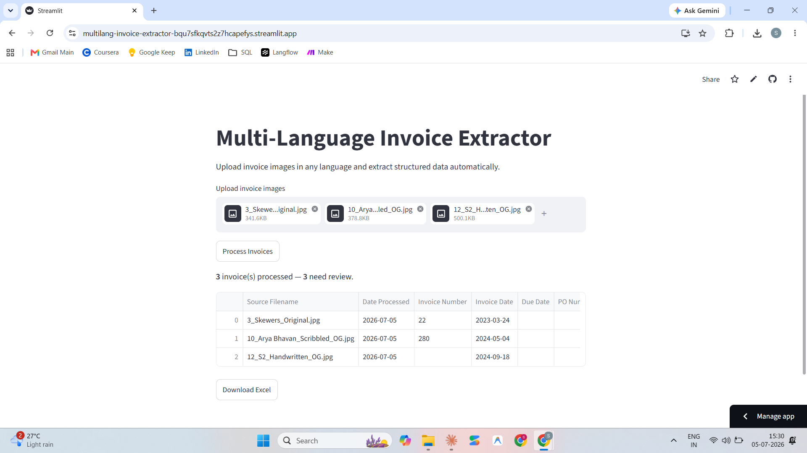

# Multi-Language Invoice Extractor

Extracts structured data from invoice images in any language using Claude's vision API, and flags results that need human review.

## Problem Statement

Manual invoice data entry doesn't scale across languages and formats: a Hindi handwritten restaurant bill, a Marathi government receipt, and an English hotel invoice each need different handling in a traditional OCR + rules pipeline. This project sends the invoice image directly to Claude's vision model instead of running OCR followed by per-language, per-layout parsing rules, so new languages and layouts don't require new code.

## ROI

- Manual entry: roughly 2 minutes per invoice.
- Automated batch: a 17-invoice batch processed end-to-end in under 1 minute.

That's a rough 30x reduction in wall-clock time for the same batch, with every result additionally flagged for confidence and arithmetic consistency so low-quality extractions aren't silently accepted.

## Live Demo

[Demo video](https://drive.google.com/file/d/15NWO7SI6g7sFYGEoSUEWquH0esX0sXLg/view?usp=sharing) — screen recording of the app processing a batch of invoices end-to-end.

## Architecture



## Tech Stack

- **Python 3.12**
- **Streamlit** — web UI, file upload, in-session results table
- **Anthropic Python SDK** (`claude-sonnet-5`) — vision-based invoice field extraction
- **openpyxl** — building the output Excel file (both the CLI's `invoices.xlsx` and the app's in-memory download)
- **pandas** — rendering the results table in the UI
- **python-dotenv** — loading `ANTHROPIC_API_KEY` from a local `.env` file during development

## Key Design Decisions

- **Vision-first extraction over OCR.** The invoice image is sent directly to Claude as an image content block, rather than running OCR and then parsing the extracted text. This avoids maintaining separate parsing rules per language and per invoice layout.
- **One row per invoice.** Each processed image is assumed to contain exactly one invoice and produces exactly one output row. Multi-invoice images are not split.
- **Discount is informational, not deducted.** The arithmetic check verifies `subtotal + tax_amount == total_amount` and deliberately excludes `discount` from that formula, since sample invoices showed discount displayed as already reflected in the subtotal rather than as a separate deduction from the total.
- **`Needs Review` is driven by three independent signals**, any one of which sets it to `Y`: the model reporting `confidence: "low"`, a non-empty `flags` list from the model, or the arithmetic check resolving to `"fail"` or `"not_verifiable"`. This means a row can be flagged even when the model itself reports high confidence, if the numbers don't add up.

## Known Limitations

- **Date ambiguity is untested.** DD/MM vs MM/DD numeric date formats are not explicitly resolved or validated against ground truth — dates are extracted as reported by the model.
- **One invoice per image is assumed.** Multi-page or multi-invoice scans are not detected or split.
- **Image input only.** JPG and PNG are supported; PDF and other document formats are not.
- **Web app persistence is session-based only.** Results in `app.py` live in Streamlit's session state and are lost on page refresh or a new session — the only durable output is the Excel file you manually download. (The separate CLI pipeline persists to `invoices.xlsx` on disk instead.)

## Demo



## Sample Output

See [sample_output.xlsx](sample_output.xlsx) for an example of the exact output format, populated with fictional data.

## Setup

```bash
git clone https://github.com/sachinj9074/multilang-invoice-extractor.git
cd multilang-invoice-extractor

python -m venv venv
venv\Scripts\activate      # Windows
# source venv/bin/activate # macOS/Linux

pip install -r requirements.txt
```

Create a `.env` file in the project root with:

```
ANTHROPIC_API_KEY=your-key-here
```

Then run the app:

```bash
streamlit run app.py
```

## Roadmap

- Google Sheets persistence (replace/supplement the local Excel file)
- PDF support
- Currency normalization across mixed-currency batches
- Duplicate invoice detection
- Analytics dashboard over processed invoice history
